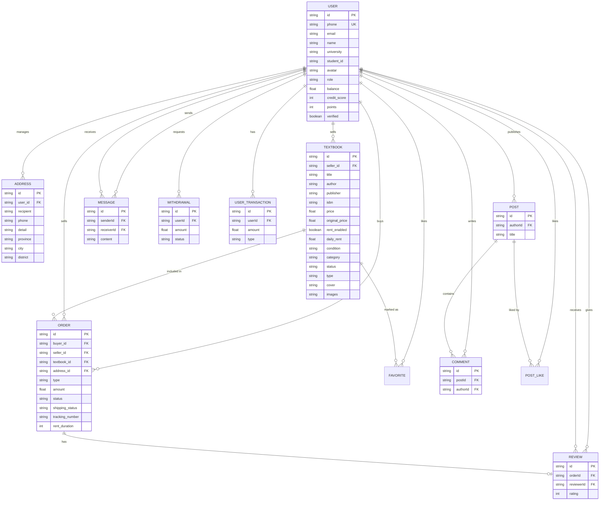

```mermaid
erDiagram
    USER ||--o{ ADDRESS : "manages"
    USER ||--o{ TEXTBOOK : "sells"
    USER ||--o{ ORDER : "buys"
    USER ||--o{ ORDER : "sells"
    USER ||--o{ MESSAGE : "sends"
    USER ||--o{ MESSAGE : "receives"
    USER ||--o{ REVIEW : "gives"
    USER ||--o{ REVIEW : "receives"
    USER ||--o{ FAVORITE : "likes"
    USER ||--o{ WITHDRAWAL : "requests"
    USER ||--o{ USER_TRANSACTION : "has"
    USER ||--o{ POST : "publishes"
    USER ||--o{ COMMENT : "writes"
    USER ||--o{ POST_LIKE : "likes"

    TEXTBOOK ||--o{ ORDER : "included in"
    TEXTBOOK ||--o{ FAVORITE : "marked as"
    
    ORDER ||--o| REVIEW : "has"

    POST ||--o{ COMMENT : "contains"
    POST ||--o{ POST_LIKE : "liked by"

    USER {
        string id PK
        string phone UK
        string email
        string name
        string university
        string student_id
        string avatar
        string role
        float balance
        int credit_score
        int points
        boolean verified
    }

    ADDRESS {
        string id PK
        string user_id FK
        string recipient
        string phone
        string detail
        string province
        string city
        string district
    }

    TEXTBOOK {
        string id PK
        string seller_id FK
        string title
        string author
        string publisher
        string isbn
        float price
        float original_price
        boolean rent_enabled
        float daily_rent
        string condition
        string category
        string status
        string type
        string cover
        string images
    }

    ORDER {
        string id PK
        string buyer_id FK
        string seller_id FK
        string textbook_id FK
        string address_id FK
        string type
        float amount
        string status
        string shipping_status
        string tracking_number
        int rent_duration
    }

    MESSAGE {
        string id PK
        string senderId FK
        string receiverId FK
        string content
    }

    REVIEW {
        string id PK
        string orderId FK
        string reviewerId FK
        int rating
    }

    USER_TRANSACTION {
        string id PK
        string userId FK
        float amount
        string type
    }

    WITHDRAWAL {
        string id PK
        string userId FK
        float amount
        string status
    }

    POST {
        string id PK
        string authorId FK
        string title
    }

    COMMENT {
        string id PK
        string postId FK
        string authorId FK
    }
```