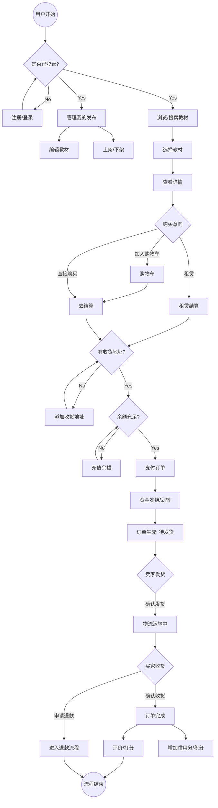

```mermaid
flowchart TD
    Start((用户开始)) --> Login{是否已登录?}
    
    Login -->|No| Register[注册/登录]
    Register --> Login
    
    Login -->|Yes| Browse[浏览/搜索教材]
    Login -->|Yes| Manage[管理我的发布]
    
    Manage --> EditItem[编辑教材]
    Manage --> ToggleShelf[上架/下架]
    
    Browse --> Select[选择教材]
    Select --> Detail[查看详情]
    
    Detail --> Action{购买意向}
    Action -->|加入购物车| Cart[购物车]
    Cart --> Checkout[去结算]
    Action -->|直接购买| Checkout
    Action -->|租赁| RentCheckout[租赁结算]
    
    RentCheckout --> Address
    Checkout --> Address{有收货地址?}
    Address -->|No| AddAddr[添加收货地址]
    AddAddr --> Address
    
    Address -->|Yes| Balance{余额充足?}
    
    Balance -->|No| Recharge[充值余额]
    Recharge --> Balance
    
    Balance -->|Yes| Pay[支付订单]
    
    Pay --> TransProcess[资金冻结/划转]
    TransProcess --> OrderStatus[订单生成: 待发货]
    
    OrderStatus --> SellerAction{卖家发货}
    SellerAction -->|确认发货| Shipping[物流运输中]
    
    Shipping --> BuyerReceive{买家收货}
    BuyerReceive -->|确认收货| Complete[订单完成]
    BuyerReceive -->|申请退款| Refund[进入退款流程]
    
    Complete --> Review[评价/打分]
    Complete --> Credit[增加信用分/积分]
    
    Review --> End((流程结束))
    Refund --> End
```