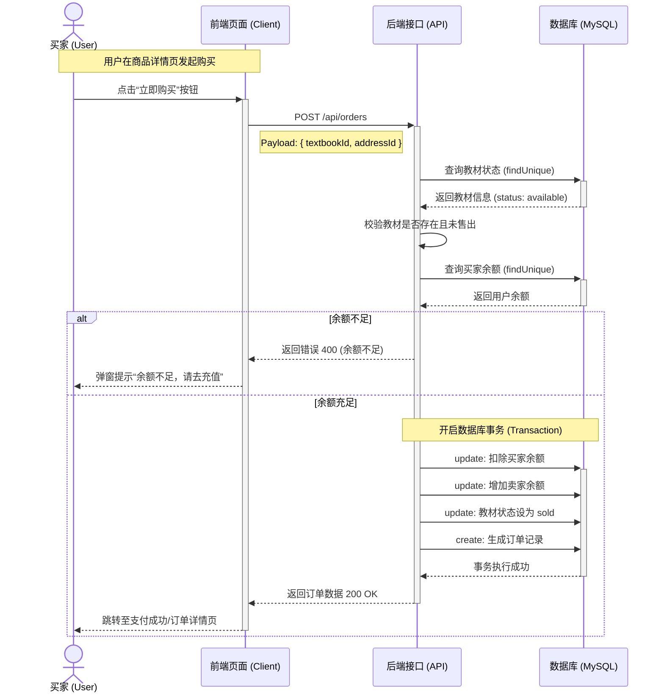
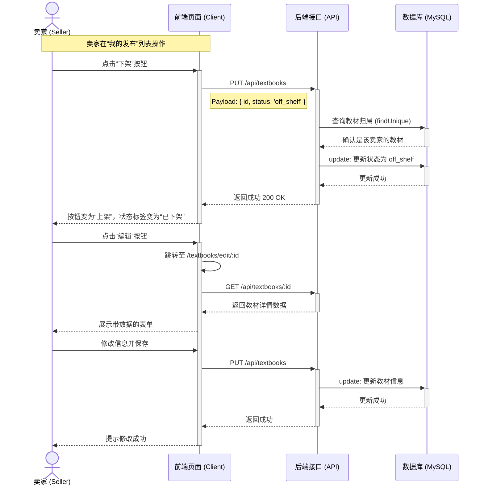
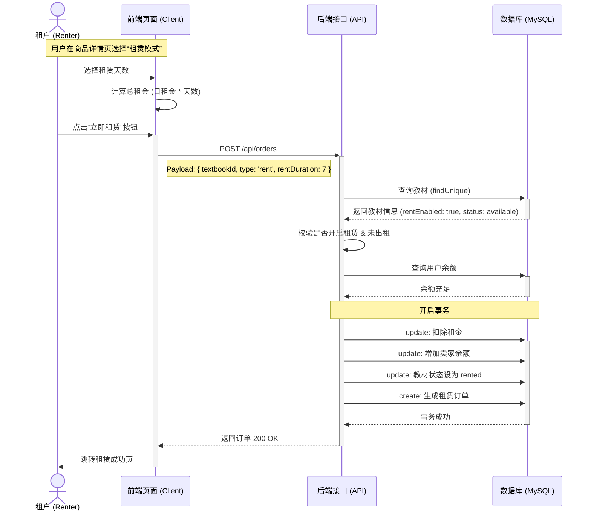

# 用户购买流程

```mermaid
sequenceDiagram
    actor User as 买家 (User)
    participant Client as 前端页面 (Client)
    participant API as 后端接口 (API)
    participant DB as 数据库 (MySQL)

    Note over User, Client: 用户在商品详情页发起购买

    User->>+Client: 点击“立即购买”按钮
    Client->>+API: POST /api/orders
    Note right of Client: Payload: { textbookId, addressId }
    
    API->>+DB: 查询教材状态 (findUnique)
    DB-->>-API: 返回教材信息 (status: available)
    
    API->>API: 校验教材是否存在且未售出
    
    API->>+DB: 查询买家余额 (findUnique)
    DB-->>-API: 返回用户余额
    
    alt 余额不足
        API-->>Client: 返回错误 400 (余额不足)
        Client-->>User: 弹窗提示“余额不足，请去充值”
    else 余额充足
        Note over API, DB: 开启数据库事务 (Transaction)
        
        API->>+DB: update: 扣除买家余额
        API->>DB: update: 增加卖家余额
        API->>DB: update: 教材状态设为 sold
        API->>DB: create: 生成订单记录
        
        DB-->>-API: 事务执行成功
        
        API-->>-Client: 返回订单数据 200 OK
        Client-->>-User: 跳转至支付成功/订单详情页
    end
```

# 卖家管理教材流程

```mermaid
sequenceDiagram
    actor Seller as 卖家 (Seller)
    participant Client as 前端页面 (Client)
    participant API as 后端接口 (API)
    participant DB as 数据库 (MySQL)

    Note over Seller, Client: 卖家在“我的发布”列表操作

    Seller->>+Client: 点击“下架”按钮
    Client->>+API: PUT /api/textbooks
    Note right of Client: Payload: { id, status: 'off_shelf' }

    API->>+DB: 查询教材归属 (findUnique)
    DB-->>-API: 确认是该卖家的教材

    API->>+DB: update: 更新状态为 off_shelf
    DB-->>-API: 更新成功

    API-->>-Client: 返回成功 200 OK
    Client-->>-Seller: 按钮变为“上架”，状态标签变为“已下架”
    
    Seller->>+Client: 点击“编辑”按钮
    Client->>Client: 跳转至 /textbooks/edit/:id
    Client->>+API: GET /api/textbooks/:id
    API-->>-Client: 返回教材详情数据
    Client-->>Seller: 展示带数据的表单
    
    Seller->>Client: 修改信息并保存
    Client->>+API: PUT /api/textbooks
    API->>+DB: update: 更新教材信息
    DB-->>-API: 更新成功
    API-->>-Client: 返回成功
    Client-->>-Seller: 提示修改成功
```

# 用户租赁流程

```mermaid
sequenceDiagram
    actor User as 租户 (Renter)
    participant Client as 前端页面 (Client)
    participant API as 后端接口 (API)
    participant DB as 数据库 (MySQL)

    Note over User, Client: 用户在商品详情页选择“租赁模式”

    User->>Client: 选择租赁天数
    Client->>Client: 计算总租金 (日租金 * 天数)
    User->>+Client: 点击“立即租赁”按钮
    Client->>+API: POST /api/orders
    Note right of Client: Payload: { textbookId, type: 'rent', rentDuration: 7 }
    
    API->>+DB: 查询教材 (findUnique)
    DB-->>-API: 返回教材信息 (rentEnabled: true, status: available)
    
    API->>API: 校验是否开启租赁 & 未出租
    
    API->>+DB: 查询用户余额
    DB-->>-API: 余额充足
    
    Note over API, DB: 开启事务
    
    API->>+DB: update: 扣除租金
    API->>DB: update: 增加卖家余额
    API->>DB: update: 教材状态设为 rented
    API->>DB: create: 生成租赁订单
    
    DB-->>-API: 事务成功
    
    API-->>-Client: 返回订单 200 OK
    Client-->>-User: 跳转租赁成功页
```