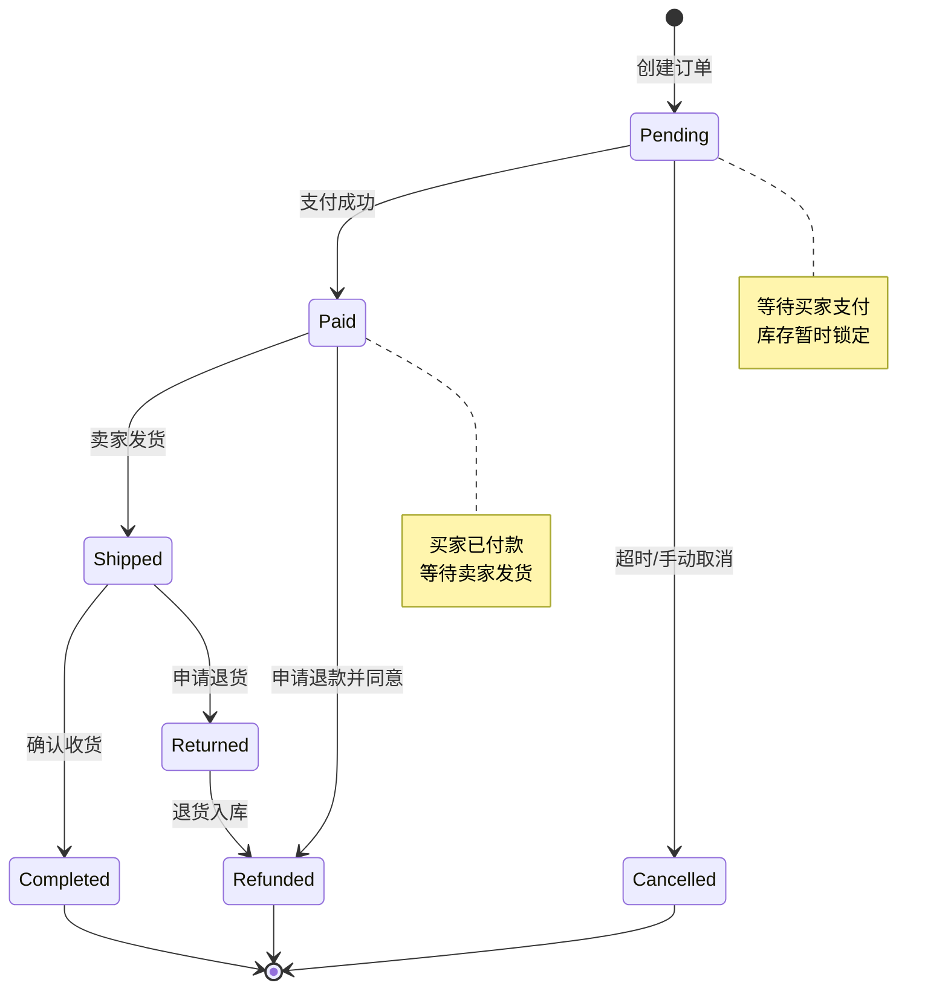
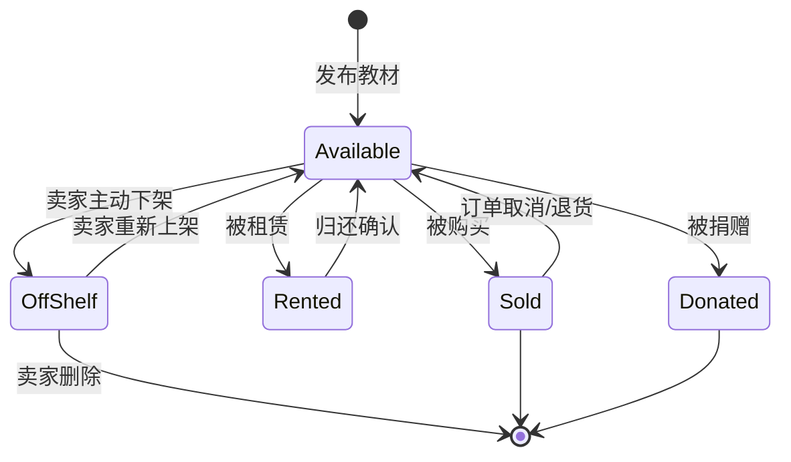

# 订单状态流转 (Order Lifecycle)

```mermaid
stateDiagram-v2
    [*] --> Pending : 创建订单
    
    Pending --> Paid : 支付成功
    Pending --> Cancelled : 超时/手动取消
    
    Paid --> Shipped : 卖家发货
    Paid --> Refunded : 申请退款并同意
    
    Shipped --> Completed : 确认收货
    Shipped --> Returned : 申请退货
    
    Returned --> Refunded : 退货入库
    
    Completed --> [*]
    Cancelled --> [*]
    Refunded --> [*]
    
    note right of Pending
        等待买家支付
        库存暂时锁定
    end note

    note right of Paid
        买家已付款
        等待卖家发货
    end note
```

# 教材状态流转 (Textbook Lifecycle)

```mermaid
stateDiagram-v2
    [*] --> Available : 发布教材
    
    Available --> Sold : 被购买
    Available --> Rented : 被租赁
    Available --> Donated : 被捐赠
    Available --> OffShelf : 卖家主动下架
    
    OffShelf --> Available : 卖家重新上架
    OffShelf --> [*] : 卖家删除
    
    Sold --> Available : 订单取消/退货
    Rented --> Available : 归还确认
    
    Sold --> [*]
    Donated --> [*]
```